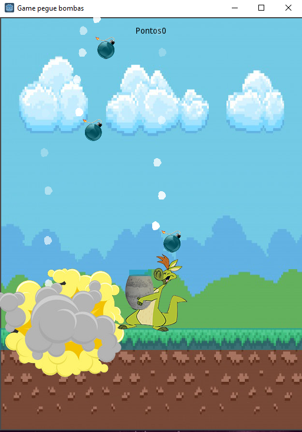
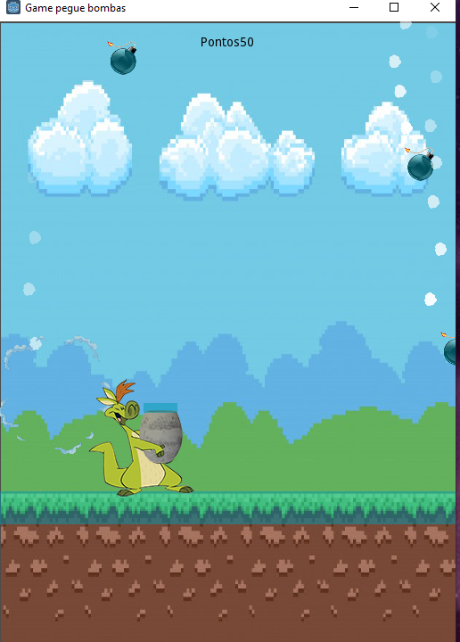
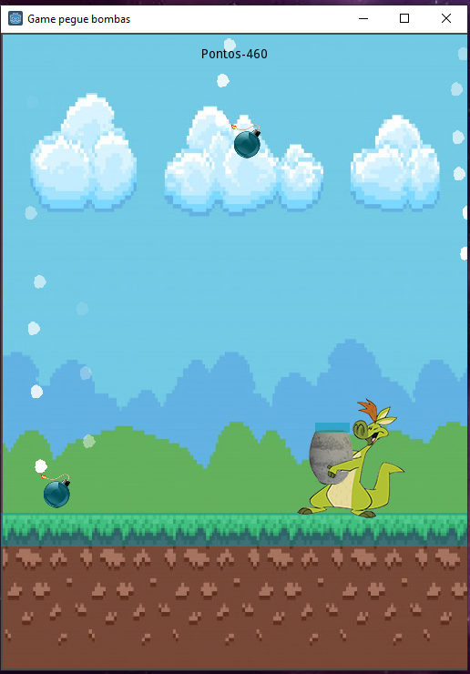

# gamepeguebomba_godot
# Game-Godot-nave
I developed this game with the help of an online course that I took on the udemy platform, which I was able to learn more about the gdscript programming language

In this game the bombs are created randomly, the doll is controlled by the arrow (right and left), if the bomb falls on the ground you will lose points, if you manage to catch the bomb you will earn points.

##Screenshot and Description
|game | game | game |
|----------|----------|----------|
|  |  | 
